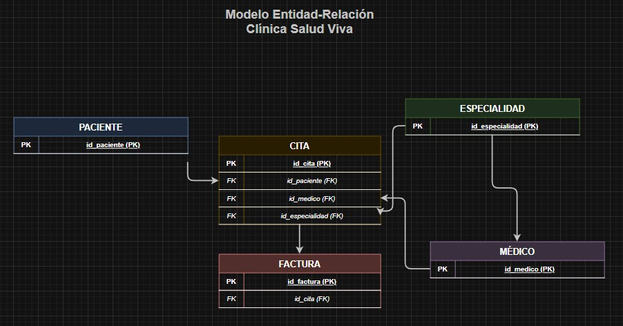

# 🗒️ Registro de Trabajo en Clase - Taller 2: Modelo de Información y Diagrama de Contexto

## 📆 Fecha de la sesión
_14 de Febrero del 2026_

## 👥 Integrantes presentes
- Bryam Diaz
- Jose Guzman
- Juan Abril

## 🧠 Actividades realizadas en clase

Durante la sesión se realizaron las siguientes actividades:

- Se discutió con el equipo el caso base de la Clínica Salud Viva, identificando las entidades principales (Paciente, Cita, Médico, Especialidad, Factura) y sus relaciones.
- Se decidió modelar las claves primarias (PK) y foráneas (FK) para representar las relaciones 1:N entre entidades.
- Se identificaron los actores (Paciente, Médico, Asistente Administrativo, Aseguradora/EPS) y los sistemas (Agendamiento, ERP Clínico, Base de Datos de Pacientes, Notificador, Facturación) para el diagrama de contexto.
- Se utilizó **draw.io** para crear los borradores del modelo ER y del diagrama de contexto.
- Se alcanzó a desarrollar el modelo ER completo con las 5 entidades y sus relaciones, así como el diagrama de contexto con los flujos de datos entre actores y sistemas.

## 🧩 Boceto inicial del modelo

### Modelo Entidad-Relación (borrador)

> Archivo fuente: [modelo-er-borrador.drawio](modelo-er-borrador.drawio)

### Diagrama de Contexto (borrador)

> Archivo fuente: [contexto-borrador.drawio](contexto-borrador.drawio)

## 🔁 Tareas definidas para complementar el taller

Anote las responsabilidades acordadas entre los miembros del equipo para completar la entrega final:

| Tarea asignada | Responsable | Fecha estimada |
|----------------|-------------|----------------|
| Modelado final en draw.io | Bryam Diaz | 16/02 |
| Redacción del informe     | Juan Abril | 18/02 |
| Investigación y referencias | Hector Guzman | 20/02 |

---

_Este documento resume el trabajo colaborativo realizado durante la sesión del taller 2 en el curso AREM - Universidad de La Sabana._
